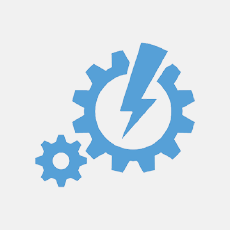

# Azure Automation (Preview)

Azure Automation provides tools to manage your cloud and on-premises infrastructure seamlessly.

# Actions

## Get job output
Get outputs of an Azure Automation job.

**Operation Id:** GetJobOutput

#### Parameters
| Summary | Type | Description | Required |
|---------|------|-------------|----------|
| Subscription | string | The unique identifier for the Microsoft Azure subscription. The subscription ID forms part of the ID for every Azure resource. | true |
| Resource Group | string | The name of the Azure Resource Group. | true |
| Automation Account | string | The name of the Azure Automation Account. | true |
| Job ID | string | GUID for the ID of the run. | true |

#### Returns
| Summary | Type | Description |
|---------|------|-------------|
| Content | binary | Runbook content from the job |

___

## Get status of job
Get Status of a Job

**Operation Id:** GetStatusOfJob

#### Parameters
| Summary | Type | Description | Required |
|---------|------|-------------|----------|
| Subscription | string | The unique identifier for the Microsoft Azure subscription. The subscription ID forms part of the ID for every Azure resource. | true |
| Resource Group | string | The name of the Azure Resource Group. | true |
| Automation Account | string | The name of the Azure Automation Account. | true |
| Job ID | string | GUID for the ID of the run. | true |

#### Returns
| Summary | Type | Description |
|---------|------|-------------|
| [CreateJobResponse](#createjobresponse) | object |  |

___

## Create job
Create Job to run on hybrid worker

**Operation Id:** CreateJob

#### Parameters
| Summary | Type | Description | Required |
|---------|------|-------------|----------|
| Subscription | string | The unique identifier for the Microsoft Azure subscription. The subscription ID forms part of the ID for every Azure resource. | true |
| Resource Group | string | The name of the Azure Resource Group. | true |
| Automation Account | string | The name of the Azure Automation Account. | true |
| Runbook Name | string | Name of the runbook to run. |  |
| body | dynamic |  | true |
| Wait for Job | boolean | Wait for the job to finish before completing the action. | false |

#### Returns
| Summary | Type | Description |
|---------|------|-------------|
| [CreateJobResponse](#createjobresponse) | object |  |

___

## Objects

### AutomationAccountResponse

| Summary | Type | Description | Path |
|---------|------|-------------|------|
| value | array of object | value | value |
| Automation account Name | string | Name of the Azure Automation account. | value.name |

### SubscriptionListResult
Subscription list operation response.

| Summary | Type | Description | Path |
|---------|------|-------------|------|
| value | Array of [Subscription](#subscription) | The subscriptions. | value |
| Next Link | string | The URL to get the next set of results. | nextLink |

### Subscription
Subscription information.

| Summary | Type | Description | Path |
|---------|------|-------------|------|
| Id | string | The fully qualified Id. For example, /subscriptions/00000000-0000-0000-0000-000000000000. | id |
| Subscription Id | string | The subscription Id. | subscriptionId |
| Tenant Id | string | The tenant Id. | tenantId |
| Display Name | string | The subscription display name. | displayName |
| State | string | The subscription state. | state |
| Authorization Source | string | The authorization source of the request. Valid values are one or more combinations of Legacy, RoleBased, Bypassed, Direct and Management. For example, &#x27;Legacy, RoleBased&#x27;. | authorizationSource |

### ResourceGroupListResult
List of resource groups.

| Summary | Type | Description | Path |
|---------|------|-------------|------|
| value | Array of [ResourceGroup](#resourcegroup) | The list of resource groups. | value |
| Next Link | string | The URL to get the next set of results. | nextLink |

### ResourceGroup
Resource group information.

| Summary | Type | Description | Path |
|---------|------|-------------|------|
| Id | string | The ID of the resource group (e.g. /subscriptions/XXX/resourceGroups/YYY). | id |
| Name | string | The Name of the resource group. | name |
| Managed By | string | Id of the resource that manages this resource group. | managedBy |

### RunbookListResults

| Summary | Type | Description | Path |
|---------|------|-------------|------|
| value | array of object |  | value |
| Runbook Name | string | Name of the Automation runbook. | value.name |

### CreateJobResponse

| Summary | Type | Description | Path |
|---------|------|-------------|------|
| Resource ID | string | Resource ID of the Job | id |
| Job ID | string | GUID for the Job ID. | properties.jobId |
| Provisioning State | string | Provisioning state for the job. | properties.provisioningState |
| Creation Time | date-time | Creation time for the job. | properties.creationTime |
| End Time | date-time | Time the job completed. | properties.endTime |
| Start Time | date-time | Time the job started. | properties.startTime |
| Status | string | Status of the job. | properties.status |
| Status Details | string | Details on the status of the job. | properties.statusDetails |

## Limits
| Name | Calls | Renewal Period |
|------|-------|----------------|
| API calls per connection | 1200 | 60 seconds |
| Frequency of trigger polls | 1 | 15 seconds |

