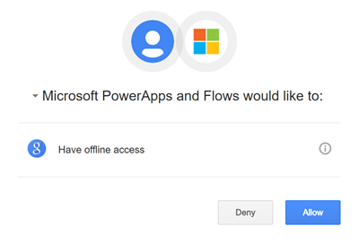

# Google Calendar

v1.1

Google Calendar lets you organize your schedule and share events with co-workers and friends. With Google&#x27;s free online calendar, it&#x27;s easy to keep track of your daily schedule.

## Creating a connection
To use this integration, you will need a Google account. If you are not a user yet,  [sign up](https://google.com/) for a new account.
When trying to make a connection, you will be prompted to authenticate against your account. If you have multiple accounts, pick the one you would like to use and **Sign in**. 
Once verified, you will need to authorize Microsoft to access your contacts. Click on **Allow** to continue. 

You&#x27;re now ready to start using this integration. 

# Actions
___

## List calendars
Lists all calendars in the authenticated user&#x27;s calendar list.

**Operation Id:** ListCalendars

#### Parameters
This operation does not require any input.

#### Returns
| Summary | Type | Description |
|---------|------|-------------|
| [CalendarList](#calendarlist) | object | A Google CalendarList Object |
___

## List the events on a calendar
Lists the first page of arbitrarily ordered events on the selected calendar.

**Operation Id:** ListEvents

#### Parameters
| Summary | Type | Description | Required |
|---------|------|-------------|----------|
| Calendar ID |  string  | Unique ID of the calendar to fetch events from | true |
| Min Time |  date-time  | Time format: yyyy-MM-ddTHH:mm:ss.fffZ (2016-07-20T08:00:59.000Z) | false |
| Max time |  date-time  | Time format: yyyy-MM-ddTHH:mm:ss.fffZ (2016-07-20T09:00:59.000Z) | false |

#### Returns
| Summary | Type | Description |
|---------|------|-------------|
| [CalendarEventList](#calendareventlist) | object | A Google CalendarEventList Object |
___

## Create an event
Creates an event on a specific calendar

**Operation Id:** CreateEvent

#### Parameters
| Summary | Type | Description | Required |
|---------|------|-------------|----------|
| Calendar ID |  string  | Unique ID of the calendar to fetch events from | true |
| New Event | [RequestEvent](#requestevent) | The new event to add to the calendar | true |

#### Returns
| Summary | Type | Description |
|---------|------|-------------|
| [ResponseEvent](#responseevent) | object | An event downloaded from Google Calendar |
___

## Get an event
Get an event from a calendar

**Operation Id:** GetEvent

#### Parameters
| Summary | Type | Description | Required |
|---------|------|-------------|----------|
| Calendar ID |  string  | Unique ID of the calendar to fetch events from | true |
| Event ID |  string  | Unique ID of the event to get | true |

#### Returns
| Summary | Type | Description |
|---------|------|-------------|
| [ResponseEvent](#responseevent) | object | An event downloaded from Google Calendar |
___

## Delete an event
Delete an event from a calendar

**Operation Id:** DeleteEvent

#### Parameters
| Summary | Type | Description | Required |
|---------|------|-------------|----------|
| Calendar ID |  string  | Unique ID of the calendar to fetch events from | true |
| Event ID |  string  | Unique ID of the event to update | true |

#### Returns
This operation does not return anything.
___

## Update an event
Update an event on a calendar

**Operation Id:** UpdateEvent

#### Parameters
| Summary | Type | Description | Required |
|---------|------|-------------|----------|
| Calendar ID |  string  | Unique ID of the calendar to fetch events from | true |
| Event ID |  string  | Unique ID of the event to get | true |
| Updated Event | [PatchEvent](#patchevent) | The updated event - only provide fields to be updated | true |

#### Returns
| Summary | Type | Description |
|---------|------|-------------|
| [ResponseEvent](#responseevent) | object | An event downloaded from Google Calendar |
___

# Triggers
___

## When an event is added to a calendar
Triggers a flow when a new event is added to a calendar

**Operation Id:** OnNewEventInCalendar

#### Parameters
| Summary | Type | Description | Required |
|---------|------|-------------|----------|
| Calendar ID |  string  | Unique ID of the calendar to fetch events from | true |

#### Returns
| Summary | Type | Description |
|---------|------|-------------|
| [CalendarEventList](#calendareventlist) | object | A Google CalendarEventList Object |
___

## When an event is updated in a calendar
Triggers a flow when an event is updated in a calendar

**Operation Id:** OnUpdatedEventInCalendar

#### Parameters
| Summary | Type | Description | Required |
|---------|------|-------------|----------|
| Calendar ID |  string  | Unique ID of the calendar to fetch events from | true |

#### Returns
| Summary | Type | Description |
|---------|------|-------------|
| [CalendarEventList](#calendareventlist) | object | A Google CalendarEventList Object |
___

## When an event is deleted from a calendar
Triggers a flow when a new event is deleted from a calendar

**Operation Id:** OnDeletedEventInCalendar

#### Parameters
| Summary | Type | Description | Required |
|---------|------|-------------|----------|
| Calendar ID |  string  | Unique ID of the calendar to fetch events from | true |

#### Returns
| Summary | Type | Description |
|---------|------|-------------|
| [CalendarEventList](#calendareventlist) | object | A Google CalendarEventList Object |
___

## When an event starts
Triggers a flow when an event starts

**Operation Id:** OnEventStarted

#### Parameters
| Summary | Type | Description | Required |
|---------|------|-------------|----------|
| Calendar ID |  string  | Unique ID of the calendar to fetch events from | true |

#### Returns
| Summary | Type | Description |
|---------|------|-------------|
| [CalendarEventList](#calendareventlist) | object | A Google CalendarEventList Object |
___

## Objects

### CalendarList
A Google CalendarList Object

| Summary | Type | Description |
|---------|------|-------------|
| Items | Array of  [CalendarListEntry](#calendarlistentry)  | Calendars in the list |

### CalendarListEntry
A Google CalendarListEntry Object

| Summary | Type | Description |
|---------|------|-------------|
| Calendar ID | string | Identifier of the calendar |
| Summary | string | Title of the calendar |
| Description | string | Description of the calendar |
| Location | string | Geographic location of the calendar as free-form text |
| Time Zone | string | The time zone of the calendar |

### CalendarEventList
A Google CalendarEventList Object

| Summary | Type | Description |
|---------|------|-------------|
| Items | Array of  [ResponseEvent](#responseevent)  | Events in the calendar |

### ResponseEvent
An event downloaded from Google Calendar

| Summary | Type | Description |
|---------|------|-------------|
| Title | string | A summary of the event |
| Start time | date-time | The (inclusive) start time of the event |
| End time | date-time | The (exclusive) end time of the event |
| Description | string | Description of the event |
| Location | string | Geographic location of the event as free-form text |
| Status | string | Status of the event. Possible values are &quot;confirmed&quot;, &quot;tentative&quot;, or &quot;cancelled&quot; |
| HTML link | string | Unique ID of the list |
| Event ID | string | Opaque identifier of the event |
| Attendees | string | The event&#x27;s attendees |
| Creator | string | The creator of the event |
| Organizer | string | The organizer of the event |

### RequestEvent
An event to upload to Google Calendar

| Summary | Type | Description |
|---------|------|-------------|
| Title | string | A summary of the event |
| Start time | date-time | The (inclusive) start time of the event |
| End time | date-time | The (exclusive) end time of the event |
| Description | string | Description of the event |
| Location | string | Geographic location of the event as free-form text |
| Attendees | string | Enter a comma-separated list of attendee emails |
| Status | string | Status of the event. Possible values are &quot;confirmed&quot;, &quot;tentative&quot;, or &quot;cancelled&quot; |

### PatchEvent
Event changes to upload to Google Calendar

| Summary | Type | Description |
|---------|------|-------------|
| Title | string | A summary of the event |
| Start time | date-time | The (inclusive) start time of the event |
| End time | date-time | The (exclusive) end time of the event |
| Description | string | Description of the event |
| Location | string | Geographic location of the event as free-form text |
| Attendees | string | Enter a comma-separated list of attendee emails |
| Status | string | Status of the event. Possible values are &quot;confirmed&quot;, &quot;tentative&quot;, or &quot;cancelled |

## Throttling
| Name | Calls | Renewal Period |
|------|-------|----------------|
| API calls per connection | 30 | 60 seconds |
| Frequency of trigger polls | 1 | 15 seconds |
