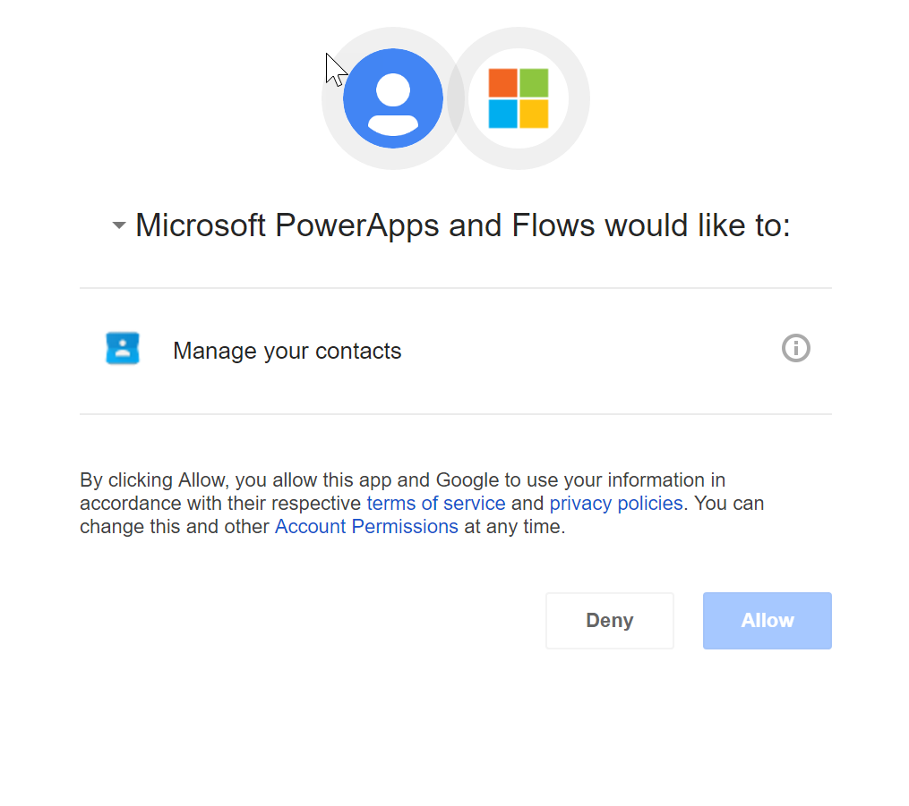

# Google Contacts (Preview)

v1.0.0

Google Contacts is an online address book, integrated across your Google products and more.

## Creating a connection

To use this integration, you will need a Google account. If you are not a user yet,  [sign up](https://google.com/) for a new account.
When trying to make a connection, you will be prompted to authenticate against your account. If you have multiple accounts, pick the one you would like to use and **Sign in**. 
Once verified, you will need to authorize Microsoft to access your contacts. Click on **Allow** to continue. 

You&#x27;re now ready to start using this integration. 

# Actions

## Get my contacts
Get my contacts.

**Operation Id:** ListContacts

#### Parameters
This operation does not require any input.

#### Returns
| Summary | Type | Description | Path |
|---------|------|-------------|------|
| Contact | Array of [Entry](#entry) |  | feed.entry |

___

## Create a contact
Create a contact within Google Contacts

**Operation Id:** CreateContact

#### Parameters
| Summary | Type | Description | Required |
|---------|------|-------------|----------|
| Display Name | string | Display name for the contact. | true |
| Work Email Address | string |  | false |
| Group | string | Group to add the contact to. | false |
| Company | string |  | false |
| Work Phone Number | string |  | false |
| Mobile Phone Number | string |  | false |
| Home Email Address | string | Home Email address for the contact. | false |
| Other Email Address | string |  | false |
| Nickname | string |  | false |
| Home Address | string |  | false |
| Work Address | string |  | false |
| Other Address | string |  | false |
| Job Title | string |  | false |
| Home Phone Number | string |  | false |
| Other Phone Number | string |  | false |
| Notes | string |  | false |

#### Returns
| Summary | Type | Description | Path |
|---------|------|-------------|------|
| [Entry](#entry) | object |  | entry |

___

# Triggers

## When a contact changes
When a contact changes in Google Contacts.

**Operation Id:** OnContactUpdated

#### Parameters
This operation does not require any input.

#### Returns
| Summary | Type | Description | Path |
|---------|------|-------------|------|
|  | Array of [Entry](#entry) |  | feed.entry |

___

## Objects

### Entry

| Summary | Type | Description | Path |
|---------|------|-------------|------|
| Id | string | The id of the contact. | id.$t |
| Updated DateTime | date-time | The datetime the contact was last updated, in yyyy-MM-ddTHH:mm:ss.fffZ (2016-07-20T08:00:59.000Z). | updated.$t |
| Title | string | The job title of the contact. | title.$t |
| Full Name | string | The full name of the contact. | gd$name.gd$fullName.$t |
| Given Name | string | The given name of the contact. | gd$name.gd$givenName.$t |
| Last Name | string | The family name of the contact. | gd$name.gd$familyName.$t |
| Nickname | string | The nickname of the contact. | gContact$nickname.$t |
| gd$organization | array of object |  | gd$organization |
| Name | string | The origanization name. | gd$organization.gd$orgName.$t |
| Title | string | The organization title. | gd$organization.gd$orgTitle.$t |
| Work Email | string | The work email address of the contact. | workEmail |
| Home Email | string | The home address of the contact. | homeEmail |
| Other Email | string | The other address of the contact. | otherEmail |
| Work Phone Number | string | The work phone number of the contact. | workPhoneNumber |
| Home Phone Number | string | The home phone number of the contact. | homePhoneNumber |
| Other Phone Number | string | The other phone number of the contact. | otherPhoneNumber |
| Mobile Phone Number | string | The mobile phone number of the contact. | mobilePhoneNumber |
| Work Address | string | The work address of the contact. | workAddress |
| Home Address | string | The home address of the contact. | homeAddress |
| Other Address | string | The other address of the contact. | otherAddress |

## Limits
| Name | Calls | Renewal Period |
|------|-------|----------------|
| API calls per connection | 100 | 60 seconds |
| Frequency of trigger polls | 1 | 120 seconds |

