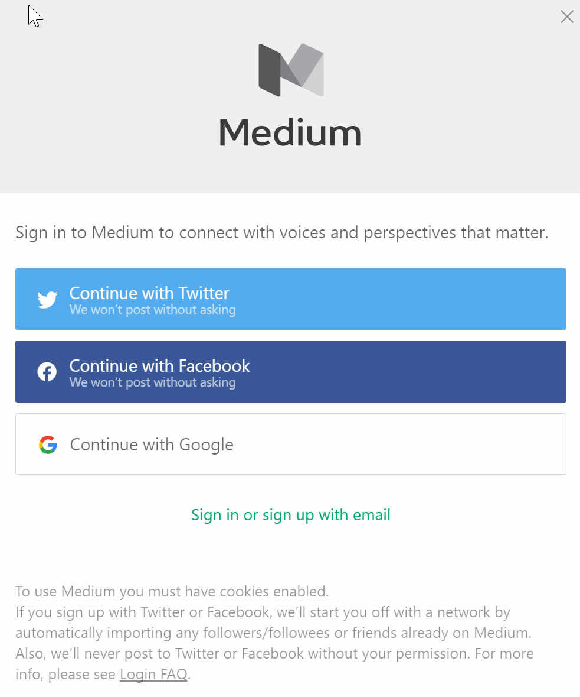

# Medium (Preview)

Medium is a vibrant network of thinkers who care about the world and making it better. Connect to your Medium account to track new publications, write stories and more.

## Creating a connection

To use this integration, you will need a Medium account. If you are not a user yet,  [sign up](https://medium.com/) for a new account.

When trying to make a connection, you will be prompted to authenticate against your Medium account. You can do this using your Twitter, Facebook or Google accounts. Alternately, use your email to sign in.

Once verified, you will need to authorize Microsoft to access your Medium profile. Click on **Okay** to continue. 

# Actions

## Write a story
Write a new story.

**Operation Id:** WriteStory

#### Parameters
| Summary | Type | Description | Required |
|---------|------|-------------|----------|
| Title | string |  | true |
| Content (as html) | string |  | true |
| Tags | string |  | false |
| Publish Status | string |  | false |

#### Returns
| Summary | Type | Description | Path |
|---------|------|-------------|------|
| Id | string | The id of the story. | data.id |
| Title | string | The story title. | data.title |
| Author Id | string | The author id of the story. | data.authorId |
| URL | string | The URL to the story in Medium. | data.url |
| Canonical URL | string | The canonical URL to the story in Medium. | data.canonicalUrl |
| Publish Status | string | The publish status of the story, such as Draft or Public. | data.publishStatus |
| License | string | The license associated with the story. | data.license |
| License Url | string | The license URL associated with the story. | data.licenseUrl |
| Tags | array of string | An array of tags on the story. | data.tags |

___

## Write a story under a publication
Write a story under a publication.

**Operation Id:** WriteStoryToPublication

#### Parameters
| Summary | Type | Description | Required |
|---------|------|-------------|----------|
| Publication | string |  | true |
| Title | string |  | true |
| Content (as html) | string |  | true |
| Tags | string |  | false |
| Publish Status | string |  | false |

#### Returns
| Summary | Type | Description | Path |
|---------|------|-------------|------|
| Id | string | The id of the story. | data.id |
| Title | string | The title of the story. | data.title |
| Author Id | string | The id of the author of the story. | data.authorId |
| URL | string | The URL to the story in Medium. | data.url |
| Canonical Url | string | The canonical URL to the story in Medium. | data.canonicalUrl |
| Publish Status | string | The publish status of the story, such as Draft or Public. | data.publishStatus |
| License | string | The license associated with the story. | data.license |
| License Url | string | The license URL associated with the story. | data.licenseUrl |
| Tags | array of string | An array of tags on the story. | data.tags |
| Publication Id | string |  | data.publicationId |

___

# Triggers

## When a publication is created or subscribed to
Triggers a new flow when a publication is created or subscribed to

**Operation Id:** TriggerPublicationAdded

#### Parameters
This operation does not require any input.

#### Returns
| Summary | Type | Description |
|---------|------|-------------|
| [publications](#publications) | object |  |

___

## Objects

### 677fc051-0605-4730-8926-c6bb62a9073a

| Summary | Type | Description | Path |
|---------|------|-------------|------|
| id | string |  | data.id |
| username | string |  | data.username |
| name | string |  | data.name |
| url | string |  | data.url |
| imageUrl | string |  | data.imageUrl |

### publications

| Summary | Type | Description | Path |
|---------|------|-------------|------|
| Publication | array of object |  | data |
| Id | string | The id of the publication. | data.id |
| Name | string | The name of the publication. | data.name |
| Description | string | The description of the publication. | data.description |
| URL | string | The URL to the publication in Medium. | data.url |
| Image Url | string | The image URL for the publication. | data.imageUrl |

### 952182ce-710d-43dc-9a5b-a7ee6d412856

| Summary | Type | Description | Path |
|---------|------|-------------|------|
| id | string |  | data.id |
| title | string |  | data.title |
| authorId | string |  | data.authorId |
| url | string |  | data.url |
| canonicalUrl | string |  | data.canonicalUrl |
| publishStatus | string |  | data.publishStatus |
| license | string |  | data.license |
| licenseUrl | string |  | data.licenseUrl |
| tags | array of string |  | data.tags |

### 7dc2cb6a-b492-4991-b628-7a7498e33749

| Summary | Type | Description | Path |
|---------|------|-------------|------|
| id | string |  | data.id |
| title | string |  | data.title |
| authorId | string |  | data.authorId |
| url | string |  | data.url |
| canonicalUrl | string |  | data.canonicalUrl |
| publishStatus | string |  | data.publishStatus |
| license | string |  | data.license |
| licenseUrl | string |  | data.licenseUrl |
| tags | array of string |  | data.tags |
| publicationId | string |  | data.publicationId |

## Limits
| Name | Calls | Renewal Period |
|------|-------|----------------|
| API calls per connection | 100 | 60 seconds |
| Frequency of trigger polls | 1 | 120 seconds |

