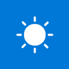

# MSN Weather (Preview)

v1.0.0

MSN Weather gets you the very latest weather forecast, including temperature, humidity, precipitation for your location.

# Actions

## Get current weather
Get the current weather for a location.

**Operation Id:** CurrentWeather

#### Parameters
| Summary | Type | Description | Required |
|---------|------|-------------|----------|
| Location |  string  |  | true |
| Units |  string  |  | true |

#### Returns
| Summary | Type | Description |
|---------|------|-------------|
| [CurrentWeather](#currentweather) | object |  |
___

## Get forecast for today
Get the forecast for the current day in the specified location.

**Operation Id:** TodaysForecast

#### Parameters
| Summary | Type | Description | Required |
|---------|------|-------------|----------|
| Location |  string  |  | true |
| Units |  string  |  | true |

#### Returns
| Summary | Type | Description |
|---------|------|-------------|
| [WeatherForecast](#weatherforecast) | object |  |
___

## Get the forecast for tomorrow
Get the forecast for tomorrow in the specified location.

**Operation Id:** TomorrowsForecast

#### Parameters
| Summary | Type | Description | Required |
|---------|------|-------------|----------|
| Location |  string  |  | true |
| Units |  string  |  | true |

#### Returns
| Summary | Type | Description |
|---------|------|-------------|
| [WeatherForecast](#weatherforecast) | object |  |
___

# Triggers

## When the current weather changes
Triggers a new flow when the specified weather measure changes for a location.

**Operation Id:** OnCurrentWeatherChange

#### Parameters
| Summary | Type | Description | Required |
|---------|------|-------------|----------|
| Location |  string  |  | true |
| Measure |  string  |  | true |
| When the measure... |  string  |  | true |
| Target |  float  |  | true |
| Units |  string  |  | true |

#### Returns
| Summary | Type | Description |
|---------|------|-------------|
| [CurrentWeather](#currentweather) | object |  |
___

## When the current conditions change
Triggers a new flow when the conditions change for a location.

**Operation Id:** OnCurrentConditionsChange

#### Parameters
| Summary | Type | Description | Required |
|---------|------|-------------|----------|
| Location |  string  |  | true |
| Units |  string  |  | true |

#### Returns
| Summary | Type | Description |
|---------|------|-------------|
| [CurrentWeather](#currentweather) | object |  |
___

## Objects

### CurrentWeather

| Summary | Type | Description |
|---------|------|-------------|
| Pressure | float | The atmospheric pressure. |
| Conditions | string | A caption of weather conditions such as rainy, sunny, etc. |
| Dewpoint | float | The temperature at which dew forms. |
| Apparent Temperature | float | The apparent temperature, or feels-like temperature. |
| Humidity | float | The relative humidity percentage. |
| METAR weather conditions | string | The METAR code of weather conditions. |
| METAR Sky Conditions | string | The METAR code of sky conditions. |
| Temperature | float | The current temperature. |
| UV Index | float | The numerical UV index. |
| UV Index Description | string | A description of the meaning of the UV index. |
| Visibility Distance | float | The visibility distance. |
| Wind Direction | int32 | The wind direction in degrees clockwise from north. |
| Wind Speed | float | The wind speed. |
| Wind Gust Speed | float | The wind gust speed. |
| Last Updated | date-time | The datetime at which provider created the current condition. |
| Latitude | float | The latitude of the location. |
| Longitude | float | The longitude of the location. |
| Click-through Link | string | The URL to the full weather details. |
| Location | string | The location for which provider created the current condition. |
| Pressure Units | string | Units used for pressure measurements. |
| Temperature Units | string | Units used for temperature measurements. |
| Speed Units | string | Units used for speed measurements. |
| Distance Units | string | Units used for distance measurements. |

### WeatherForecast

| Summary | Type | Description |
|---------|------|-------------|
| Conditions | string | The caption of weather conditions such as rainy, sunny, etc. |
| Rain Chance | float | The chance of precipitation (%). |
| METAR Weather Conditions | string | The METAR code of weather conditions. |
| METAR Sky Conditions | string | The METAR code of sky conditions. |
| Wind Direction | int32 | The wind direction in degrees clockwise from north. |
| Wind Speed | float | The wind speed. |
| Summary | string |  |
| Conditions | string | The caption of weather conditions such as rainy, sunny, etc. |
| Rain Chance | float | The chance of precipitation (%). |
| METAR Weather Conditions | string | The METAR code of weather conditions. |
| METAR Sky Conditions | string | The METAR code of sky conditions. |
| Wind Direction | int32 | The wind direction in degrees clockwise from north. |
| Wind Speed | float | The wind speed. |
| Summary | string |  |
| Conditions | string | The caption of weather conditions such as rainy, sunny, etc. |
| Date | date-time | The datetime at which the forecast is valid. |
| Rain Chance | float | The chance of precipitation (%). |
| Max Wind Speed | float | The peak wind speed for the day. |
| Max Wind Direction | int32 | The direction of the peak wind for the day. |
| Humidity High | float | The high relative humidity point for the day. |
| Humidity Low | float | The low relative humidity point for the day. |
| Temperature High | float | The high temperature. |
| Temperature Low | float | The low temperature. |
| UV Index | float | The numerical UV index. |
| UV Index Description | string | A description of the meaning of the UV index. |
| Forecast Date | date-time | The datetime at which the daily forecast was dervied. |
| Sunrise Time | date-time | Time of sunrise on the day of this forecast. |
| Sunset Time | date-time | Time of sunset on the day of this forecast. |
| Moonrise Time | date-time | Time of moonrise on the day of this forecast. |
| Moonset Time | date-time | Time of moonset on the day of this forecast. |
| Moon Phase | string | The phase of the moon the day of this forecast. |
| Moon Phase Code | string | The code representing the phase of the moon. |
| Latitude | float | The latitude of the location. |
| Longitude | float | The longitude of the location. |
| Click-through Link | string | The URL back to the full weather details. |
| Location | string | The location for which provider created the forecast. |
| Pressure Units | string | Units used for pressure measurements. |
| Temperature Units | string | Units used for temperature measurements. |
| Speed Units | string | Units used for speed measurements. |
| Distance Units | string | Units used for distance measurements. |

### MeasureUnits

| Summary | Type | Description |
|---------|------|-------------|
|  | array  |  |
| Display Text | string |  |
| Units | string |  |

## Limits
| Name | Calls | Renewal Period |
|------|-------|----------------|
| API calls per connection | 8 | 60 seconds |
| Frequency of trigger polls | 1 | 60 seconds |

