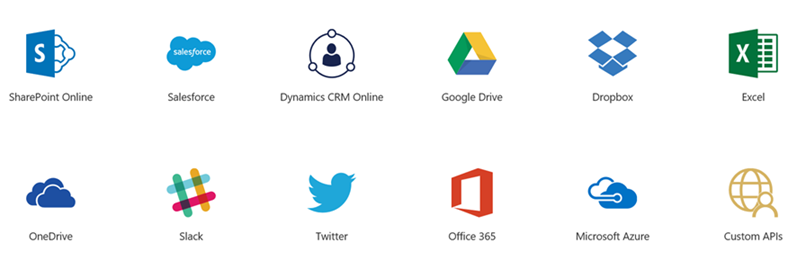
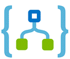

# Connectors

Connector is a simple wrapper or proxy around an existing API. Connectors make it possible to get more value out of the services you're already using.

You can connect apps, data, and devices in the cloud with our large ecosystem of software as a service (SaaS) and cloud-based connectors that includes Salesforce, Office 365, Twitter, Dropbox, Google services, and more.

## Components of a Connector

Each connector offers a set of operations classified as 'Triggers' and 'Actions'. Once you authenticate to the underlying service, these operations can be easily leveraged within your apps and workflows.

### Triggers

Several connectors provide triggers that can notify your app when specific events occur. For example, the FTP connector has the OnUpdatedFile trigger. You can build either a Logic App or Flow that listens to this trigger and performs an action whenever the trigger fires.

There are two types of trigger.

* Poll Triggers: These triggers poll your service at a specified frequency to check for new data. When new data is available, a new instance of your app runs with the data as input. To prevent the same data from being consumed multiple times, the trigger may clean up data that has been read and passed to your app.
	
* Push Triggers: These triggers listen for data on an endpoint or for an event to occur, then, triggers a new instance of your app. The Twitter connector is one such example.

### Actions

You can also use connectors actions in your apps. Actions are useful for looking up data, which can then be used in running your app. For example, you might need to look up customer data from a SQL database when processing an order. Or, you might need to write, update, or delete data in a destination table. You can perform these tasks using the actions provided by the connectors. Actions map to operations that are defined in the Swagger metadata.

## Using Connectors

Connectors are available for use within multiple products.

### Microsoft Flow
Work smarter by building solutions that automate processes across apps and services. Streamline notifications, sync data between systems, automate approval workflows and more.

### PowerApps
Create rich user experiences across the web, phones and tablets. Assemble forms, add business logic, and take advantage of device capabilities with full creative freedom.

[] (https://azure.microsoft.com/en-us/services/logic-apps/) 
### Logic Apps
Bring together disparate applications to deliver solutions such as payment processing, supply chain management, and more that integrate seamlessly with the rest of your apps.

